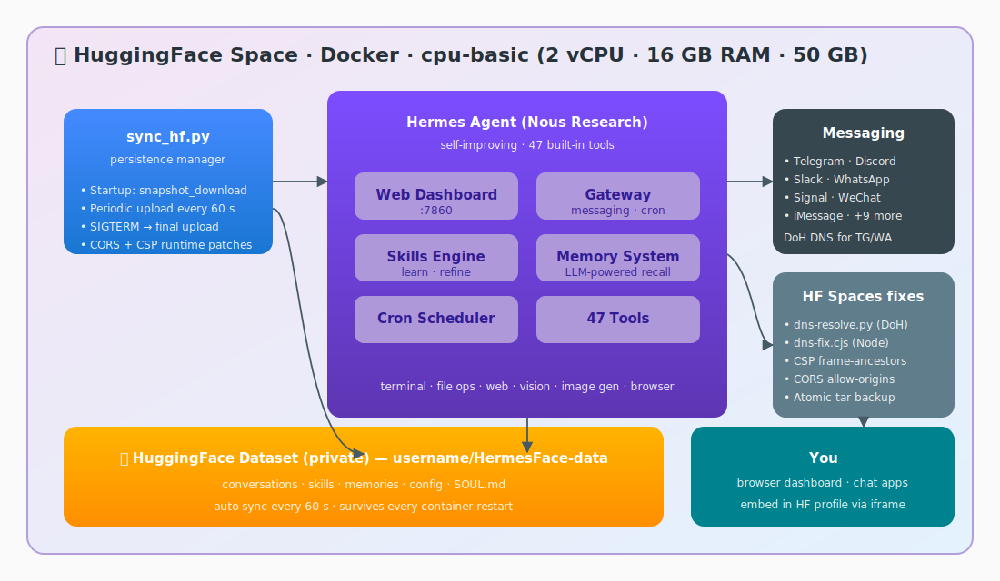

<div align="center">
  
  <br/><br/>
  <strong>Your always-on, self-improving AI agent — free, no server needed</strong>
  <br/>
  <sub>Telegram · Discord · Slack · WhatsApp · Signal · WeChat · 16+ channels · Self-improving skills · Persistent memory · One-click deploy</sub>
  <br/><br/>

  [](LICENSE)
  [](https://huggingface.co/spaces/tao-shen/HermesFace)
  [](https://github.com/democra-ai/HermesFace)
  [](https://github.com/NousResearch/hermes-agent)
  [](https://www.docker.com/)
  [](https://github.com/NousResearch/hermes-agent)
  [](https://telegram.org/)
  [](https://discord.com/)
  [](https://huggingface.co/spaces)
</div>

---

## What you get

In about 5 minutes, you'll have a **free, always-on, self-improving AI assistant** connected to Telegram, Discord, Slack, WhatsApp, and 16+ other channels — no server, no subscription, no hardware required.

| | |
|---|---|
| **Free forever** | HuggingFace Spaces gives you 2 vCPU + 16 GB RAM at no cost |
| **Always online** | Your conversations, skills, memories, and config survive every restart |
| **16+ channels** | Telegram, Discord, Slack, WhatsApp, Signal, WeChat, iMessage, and more |
| **Self-improving** | Hermes creates and refines skills from experience during use |
| **Persistent memory** | LLM-powered memory with search and summarization across sessions |
| **47 built-in tools** | Terminal, file ops, web search, vision, image generation, browser automation |
| **Any LLM** | OpenRouter (200+ models, free tier available), OpenAI, Claude, Gemini, Nous Portal |
| **Web dashboard** | React-based UI for managing config, API keys, and monitoring sessions |
| **One-click deploy** | Duplicate the Space, set two secrets, done |

> **Powered by [Hermes Agent](https://github.com/NousResearch/hermes-agent)** — Nous Research's open-source, self-improving AI assistant that normally requires your own machine. HermesFace makes it run for free on HuggingFace Spaces by adding data persistence via HF Dataset sync.

## Architecture

<div align="center">
  
</div>

---

## Quick Start

### 1. Duplicate this Space

Click **Duplicate this Space** on the [HermesFace Space page](https://huggingface.co/spaces/tao-shen/HermesFace).

> **After duplicating:** edit your Space's `README.md` and update the `datasets:` field in the YAML header to point to your own dataset repo (e.g. `your-name/YourSpace-data`), or remove it entirely. This prevents your Space from appearing as linked to the original dataset.

### 2. Set Secrets

Go to **Settings → Repository secrets** and add the following. The only two you *must* set are `HF_TOKEN` and one API key.

| Secret | Status | Description | Example |
|--------|:------:|-------------|---------|
| `HF_TOKEN` | **Required** | HF Access Token with write permission ([create one](https://huggingface.co/settings/tokens)) | `hf_AbCdEfGhIjKlMnOpQrStUvWxYz` |
| `AUTO_CREATE_DATASET` | **Recommended** | Set to `true` — HermesFace will automatically create a private backup dataset on first startup. No manual setup needed. | `true` |
| `OPENROUTER_API_KEY` | Recommended | [OpenRouter](https://openrouter.ai) API key — 200+ models, free tier available. Easiest way to get started. | `sk-or-v1-xxxxxxxxxxxx` |
| `OPENAI_API_KEY` | Optional | OpenAI API key | `sk-proj-xxxxxxxxxxxx` |
| `ANTHROPIC_API_KEY` | Optional | Anthropic Claude API key | `sk-ant-xxxxxxxxxxxx` |
| `NOUS_API_KEY` | Optional | Nous Portal API key | `nous-xxxxxxxxxxxx` |
| `GOOGLE_API_KEY` | Optional | Google / Gemini API key | `AIzaSyXxXxXxXxXx` |

### Data Persistence

HermesFace syncs `/opt/data` (conversations, skills, memories, config) to a private HuggingFace Dataset repo so your data survives every restart.

**Option A — Auto mode (recommended)**

1. Set `AUTO_CREATE_DATASET` = `true` in your Space secrets
2. Set `HF_TOKEN` with write permission
3. Done — on first startup, HermesFace automatically creates a private Dataset repo named `your-username/SpaceName-data`. Each duplicated Space gets its own isolated dataset.

**Option B — Manual mode**

1. Go to [huggingface.co/new-dataset](https://huggingface.co/new-dataset) and create a **private** Dataset repo (e.g. `your-name/HermesFace-data`)
2. Set `HERMES_DATASET_REPO` = `your-name/HermesFace-data` in your Space secrets
3. Set `HF_TOKEN` with write permission
4. Done — HermesFace will sync to this repo every 60 seconds

### Environment Variables

Fine-tune persistence and performance. Set these as **Repository Secrets** in HF Spaces, or in `.env` for local Docker.

| Variable | Default | Description |
|----------|---------|-------------|
| `AUTO_CREATE_DATASET` | `true` | Auto-create the Dataset repo on first startup |
| `SYNC_INTERVAL` | `60` | Backup interval in seconds |
| `AGENT_NAME` | `HermesFace` | Agent display name in messaging platforms |
| `TZ` | `UTC` | Timezone for logs and scheduled tasks |

> For the full list (including all Hermes Agent variables), see [`.env.example`](.env.example).

### 3. Open the Dashboard

Visit your Space URL. The Hermes Agent web dashboard provides:
- **Status Page** — agent status and session activity
- **Config Page** — dynamic configuration editor
- **Env Page** — API key management

Messaging integrations (Telegram, Discord, WhatsApp) can be configured through the dashboard or via environment variables.

## Configuration

HermesFace supports **all Hermes Agent environment variables** — it passes the entire environment to the Hermes process (`env=os.environ.copy()`), so any variable from the [Hermes Agent docs](https://github.com/NousResearch/hermes-agent) works out of the box in HF Spaces. This includes:

- **API Keys** — `OPENROUTER_API_KEY`, `OPENAI_API_KEY`, `ANTHROPIC_API_KEY`, `NOUS_API_KEY`, `GOOGLE_API_KEY`, `MISTRAL_API_KEY`
- **Messaging** — `TELEGRAM_BOT_TOKEN`, `DISCORD_BOT_TOKEN`, `SLACK_BOT_TOKEN`
- **Terminal** — `TERMINAL_BACKEND`, `TERMINAL_TIMEOUT`
- **Browser** — `BROWSERBASE_API_KEY`, `BROWSERBASE_PROJECT_ID`

HermesFace adds its own variables for persistence and deployment: `HF_TOKEN`, `HERMES_DATASET_REPO`, `AUTO_CREATE_DATASET`, `SYNC_INTERVAL`, etc. See [`.env.example`](.env.example) for the complete reference.

## Connecting Messaging Platforms

Set the appropriate bot token as a Space Secret:

| Platform | Secret | Docs |
|----------|--------|------|
| Telegram | `TELEGRAM_BOT_TOKEN` | [BotFather](https://t.me/botfather) |
| Discord | `DISCORD_BOT_TOKEN` | [Discord Developer Portal](https://discord.com/developers/applications) |
| Slack | `SLACK_BOT_TOKEN` | [Slack API](https://api.slack.com/apps) |
| WhatsApp | QR code pairing | Automatic via gateway |
| Signal | Via linked device | Configure in gateway |
| WeChat | `WEIXIN_APP_ID` + `WEIXIN_APP_SECRET` | WeChat Open Platform |

## Local Docker

```bash
git clone https://github.com/democra-ai/HermesFace.git
cd HermesFace
cp .env.example .env    # Edit with your API keys
docker build -t hermesface .
docker run -p 7860:7860 --env-file .env hermesface
```

## Security

- **Environment isolation** — each Space runs in its own Docker container, sandboxed from your local machine. Unlike running Hermes Agent locally (where it has full system privileges), cloud deployment limits the blast radius.
- **Secrets stay server-side** — API keys and tokens are set as HF Spaces Repository Secrets, never exposed to the browser or the public Dataset.
- **Private backups** — the Dataset repo is created as private by default.
- **DNS over HTTPS** — `dns-resolve.py` bypasses HF Spaces' DNS blocks on Telegram / Discord / WhatsApp via Cloudflare + Google DoH, writing `/etc/hosts` (for Python) and `/tmp/dns-resolved.json` (consumed by the Node `dns-fix.cjs` preload).

## Manual backup / restore

For one-off snapshots outside the 60-second sync cycle, use the CLI utilities in `scripts/`:

```bash
# Full tar.gz snapshot → Dataset repo (keeps last 5, auto-rotates)
python3 scripts/hermes_persist.py save

# Restore latest snapshot into /opt/data
python3 scripts/hermes_persist.py load

# Inspect current backups
python3 scripts/hermes_persist.py status
```

The atomic variants (`save_to_dataset_atomic.py`, `restore_from_dataset_atomic.py`) use HF commit operations with checksum metadata for file-granular restore — useful when you only want to roll back a single file.

## Acknowledgments

- **[Hermes Agent](https://github.com/NousResearch/hermes-agent)** by [Nous Research](https://nousresearch.com/) — the self-improving AI assistant framework HermesFace wraps
- **[HuggingFace Spaces](https://huggingface.co/spaces)** — free Docker hosting for ML apps
- **[HuggingClaw](https://github.com/tao-shen/HuggingClaw)** — sibling project that pioneered the atomic-tar persistence + DoH DNS escape-hatch patterns HermesFace adopts

## License

MIT
